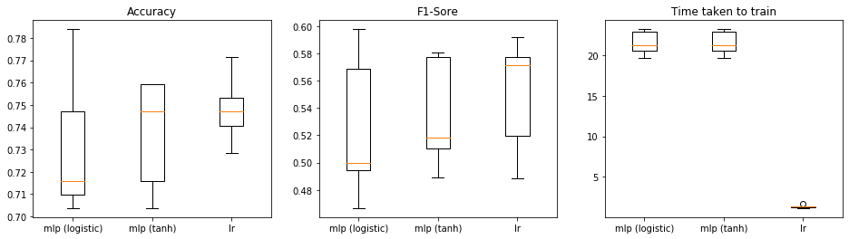
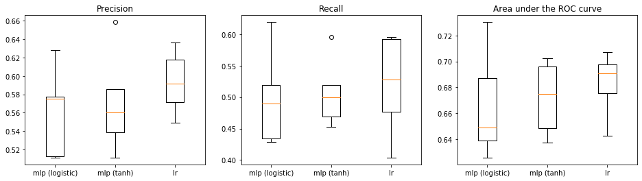

# Task
Binary Classification to classify weather a Superhero is human or not

# Dataset
Super Heroes Dataset, [kaggle](https://www.kaggle.com/claudiodavi/superhero-set/version/1)

# Chosen Methods
There are two machine learning approaches chosen to solve the problem:
1. Multi Layer Perceptron
	- MLP with `logistic` activation
	- MLP with `tanh` activation
2. Logistic Regression

## Why MLP and LR
MLP is one of the simplest feed-forward neural networks, which are proven to be good to find pattern in data. Similarly, Logistic Regression has been used in several industries for classification of binary and multi-label problems.

## Code Structure
The routine is written in 4 python scripts. The `main.py` script calls these scripts in required order and performs the following tasks:
- `preprocess.py`
	- Cleans and reshapes datasets, creates features
- `mlp.py`
	- Trains MLP with `logistic` activation
- `mlp2.py`
	- Trains MLP with `tanh` activation
- `lr.py`
	- Trains LR

The file `globals.py` contains global variables common in all modules. It contains which random seed values are taken.


## Model Parameters
### MLP
For both the cases of MLP, the following parameters are fixed for each training instance.
```python
solver='lbfgs'
alpha=1e-4
max_iter=2e2
learning_rate='adaptive'
hidden_layer_sizes=(800, 50)
```
The MLPs contain two hidden layers with 800 and 50 neurons. Considering number of features, this is a 413->800->50->1 neurons' feed-forward network.

### LR
For LR, the following parameter are set.
```python
solver='lbfgs'
max_iter=2e5
tol=1e-5
```
For LR model, LBFGS solver is selected, as the research has shown the it outperforms several algorithms.

# Results and Evaluation
The following results were generated by training each model with 5 different random seeds:


The above graphic shows that one of the MLP training instances with logistic activation function has outperformed. However, average F1-score of both the MLP cases (activation logistic and tanh) are lower than that of LR. Also, the average time taken for an MLP instance to train is approximately 20 seconds, which is less than 2 second for LR.

Considering these aspects, one could choose simply LR over MLP. However, other evaluation metrics should also be considered depending on the use-case. For example, sensitivity and recall are of much importance when False Positives (FP) are critical. Suppose, if this model was to be used for classifying every superhero in the universe into human or non-human, and let us say, punish all the non-human superheroes, then False Positives would be a dangerous outcome.

Therefore, other evaluation metrics are here to help:


# Conclusion
By comparing the mean values of precision, recall and area under the curve measures, Logistic Regression has performed relatively the best in this problem.
